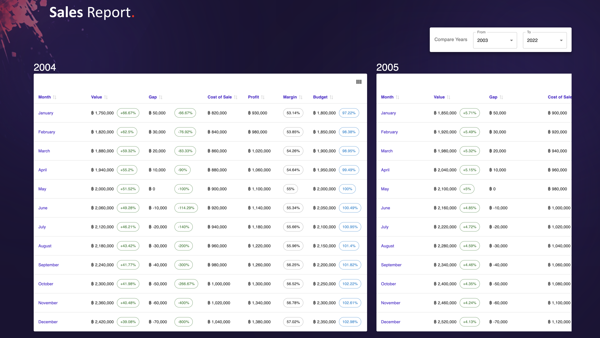

<div id="top"></div>
<div align="center">

[![LinkedIn][linkedin-shield]][linkedin-url]

</div>

<!-- PROJECT LOGO -->
<br />
<div align="center">
  <a href="">
    
  </a>
  <h1 align="center">JAGOTA ASSIGNMENT</h1>
  <p align="center">
    <a href="https://jagota-sales-report.vercel.app/" target=”_blank”><strong>View Demo »</strong></a>
    <br />
  </p>
</div>
<!-- TABLE OF CONTENTS -->
<details>
  <summary>Table of Contents</summary>
  <br />
  <ol>
    <li>
      <a href="#about-the-project">About The Project</a>
      <ul>
        <li><a href="#in-this-application-you-have-the-ability-to">Features</a></li>
        <li><a href="#built-with">Built With</a></li>
      </ul>
    </li>
    <li>
      <a href="#getting-started">Getting Started</a>
      <ul>
        <li><a href="#prerequisites">Prerequisites</a></li>
        <li><a href="#installation">Installation</a></li>
      </ul>
    </li>
    <li><a href="#contact">Contact</a></li>
  </ol>
</details>

<!-- ABOUT THE PROJECT -->

## About The Project

### Screenshots

<div align="center">
  <a href="https://jagota-sales-report.vercel.app/" target=”_blank”>
    
  </a>
</div>
<br />

### In this Application you have the ability to

- Compare yearly sales reports of a company within a range of years.
- By default it will show the sales report comparison from year 2003 to 2022.
- You can pick the `from - to` range from the section above.
- Once you selected a specific range, the body will be updated to show the sales report comparison for the given range.
- Yearly report has sales values for each month of the year.
- Each report will give you some valuable insight of the company such as,
  - Total sales value
  - Growth of sales value compared to last year
  - Gap between the budget and the achieved sales value, and gap's growth compared to last year
  - Cost of sales and it's distribution
  - Profit gained from the sales for each month after the cost, and it's margin percentage
  - Total budget planned for each month and and the percentage achieved

<p align="right">(<a href="#top">back to top</a>)</p>

### Built With

#### For Frontend

- [React.js](https://reactjs.org)
- [Next.js](https://nextjs.org/docs)
- [Typescript](https://www.typescriptlang.org)
- [Material UI](https://mui.com/material-ui)
- [Tailwind CSS](https://tailwindcss.com)
- [Zustand](https://www.mongodb.com) State Management

#### For Backend

- [NodeJS](https://nodejs.org/en)
- [Express.js](https://expressjs.com)
- [Typescript](https://www.typescriptlang.org)
- [MongoDB](https://www.mongodb.com)
- [Mongoose](https://mongoosejs.com)
- [Nodemon](https://www.npmjs.com/package/nodemon)

I have used [Vercel](https://vercel.com/) to host this application to provide a quick preview to the observers.

<p align="right">(<a href="#top">back to top</a>)</p>

<!-- GETTING STARTED -->

## Getting Started

This repository contains the both `sales-report-client` application (React + Next + TS) and `sales-report-server` application (Node + Express + TS + MongoDB)

The server connects to a free tier `MongoDB` database which is containing all the sales data from year 2003 to 2022. The frontend fetches the report data from the `Express` `NodeJS` backend.

```javascript
// Sample Sales Record in MongoDB.
{
  "year": 2004,
  "month": "January",
  "budget": 1800000,
  "achievedValue": 1750000,
  "costOfSales": 820000,
  "distribution": {
    "marketing": 420000,
    "salesTeam": 490000,
    "operations": 190000,
    "otherExpenses": 220000
  }
}
```

### Prerequisites

Make sure you have node installed in order to run this application locally.

- upgrade npm to the latest version

```sh
npm install npm@latest -g
```

### Installation

1. Clone the repo

```sh
git clone https://github.com/sudeshnt/next-news-app
```

2. Install node modules inside both sub folders `sales-report-client` `sales-report-server` using the following command

```sh
npm install
```

3. Inside both `client` and `server`, you can run following command to start dev server:

```js
npm run dev
```

4. Run the app in the development mode.

Open [http://localhost:3000](http://localhost:3000) to view the frontend app in your browser.
It'll connect to the local NodeJS server running in the background.

5. Launch the test runner in the interactive watch mode.

```js
npm run test
```

6. Builds the apps for production to the build folder.

```js
npm run build
```

<p align="right">(<a href="#top">back to top</a>)</p>

<!-- CONTACT -->

## Contact

Sudesh Nimesha - sudeshnt93@gmail.com

<p align="right">(<a href="#top">back to top</a>)</p>

<!-- MARKDOWN LINKS & IMAGES -->
<!-- https://www.markdownguide.org/basic-syntax/#reference-style-links -->

[linkedin-shield]: https://img.shields.io/badge/-LinkedIn-black.svg?style=for-the-badge&logo=linkedin&colorB=555
[linkedin-url]: https://www.linkedin.com/in/sudeshnt
